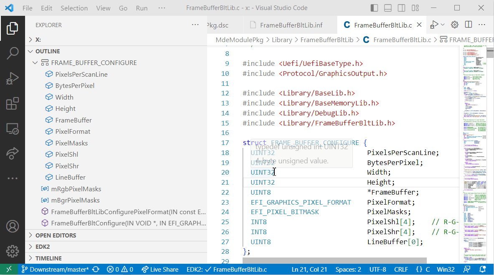
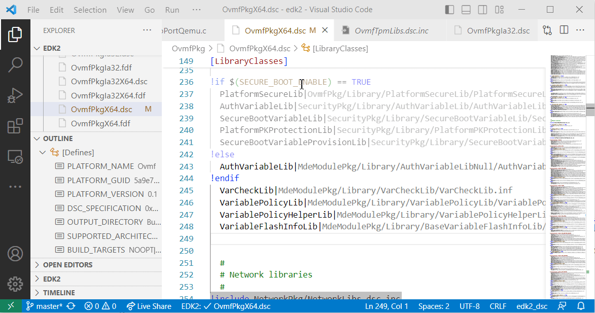
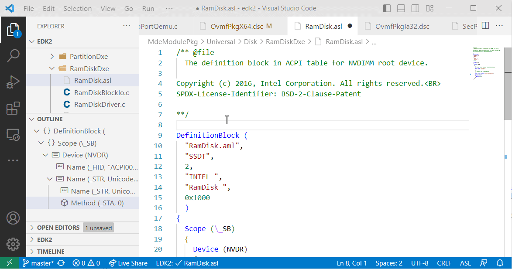

# EDK2Code Extension for Visual Studio Code

The EDK2Code Extension is a Visual Studio Code extension designed to improve the development experience for engineers working with the EDK2 (UEFI) codebase. This extension provides support for syntax highlighting, code navigation, and error detection for the EDK2 language. By integrating these features directly into Visual Studio Code, developers can streamline their workflow and enhance productivity.

Check YouTube vide presentation on UEFIForum Channel

It also includes some support for ASL language:

## Features

- Syntax highlighting for EDK2 files.
- Code navigation, including "Go to Definition" and "Find All References" for EDK2 symbols.
- Error detection and reporting for common EDK2 language issues.
- Auto-completion for EDK2 keywords and symbols.

## Installation

1. Open Visual Studio Code.
2. Navigate to the Extensions view by clicking the square icon on the left sidebar or pressing `Ctrl+Shift+X`.
3. Search for "EDK2Code" in the search bar.
4. Click the "Install" button on the extension's card.
5. Reload Visual Studio Code to activate the extension.

### Linux Installation

[Cscope](https://cscope.sourceforge.net/) is used for some C related functionality of the extension. On windows systems the cscope comes already included in the extension.

For linux systems you need to install cscope`manually.

Ubuntu installation example: `sudo apt install cscope`

## Documentation

Check full documentation including setup on [project home page](https://intel.github.io/Edk2Code/)

## Contributing

If you would like to contribute to the development of the EDK2Code Extension, please visit the [GitHub repository](https://github.com/intel/Edk2Code) for more information on how to submit issues, feature requests, or pull requests.

## Support

For support or questions regarding the EDK2Code Extension, please create an issue in the [GitHub repository](https://github.com/intel/Edk2Code/issues).
