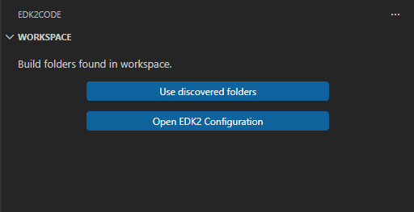

# Quick start
Most of the extension functionality will work out of the box on any given EDK2 project. However it will have the full set of features enabled when the source code is compiled and the workspace is loaded.

## Loading the workspace

When you open a folder that contains an EDK2 project, the **Workspace** view (in the Edk2Code activity bar panel) will guide you through loading your build configuration.



### Option 1 — Auto-discover build folders (recommended)

If you have already compiled your EDK2 project, click **Discover Build Folders**. The extension will scan your workspace and detect all existing build output folders automatically.

Once discovery completes, click **Use discovered folders** to load the detected configurations. The Workspace view will populate with your DSC, INF, and source file hierarchy.

You can also trigger this at any time from the [command palette](https://code.visualstudio.com/docs/getstarted/userinterface#_command-palette):

```
> EDK2: Discover build folders
> EDK2: Use discovered build folders
```

### Option 2 — Manual configuration

Click **Open EDK2 Configuration** (or run `EDK2: Workspace configuration (UI)`) to open the settings panel and manually specify:

- **DSC paths** — the main `.dsc` files for your platform
- **Build Defines** — any `-D` flags used in your build command
- **Package paths** — extra package roots passed to the build

```
> EDK2: Workspace configuration (UI)
```

### Rebuild / Rescan

To force a full re-index after a new build, use:

```
> EDK2: Rebuild index database
```

To reload using the existing configuration without changing any settings:

```
> EDK2: Rescan index database
```

## Enable compile information

You can use the [compile information](https://github.com/tianocore/edk2/commit/4ad7ea9c842289aed6ed519f9fce33cf37cfc2a9) build feature from EDK2 to provide more build information to the extension. This is optional but recommended

To enable the compile information you need to enable the [build report flag](https://tianocore-docs.github.io/edk2-BuildSpecification/release-1.28/13_build_reports/#13-build-reports) in the EDK2 `build` command and set `-Y COMPILE_INFO`. You can check more information about EDK build process [here](https://github.com/tianocore/tianocore.github.io/wiki/Windows-systems#build)

For example, if you want to build `EmulatorPkg` from EDK2 source, your build command will look like this:

```shell
build -p EmulatorPkg\EmulatorPkg.dsc -t VS2019 -a IA32 -Y COMPILE_INFO -y BuildReport.log
```

This will generate [compile information](https://github.com/tianocore/edk2/commit/4ad7ea9c842289aed6ed519f9fce33cf37cfc2a9) in your build folder.

`-Y COMPILE_INFO -y BuildReport.log` will add to your build folder the `CompileInfo` folder:

`x:\Edk2\Build\EmulatorIA32\DEBUG_VS2019\CompileInfo`

# Files produced after parsing

After parsing is completed, some files will be created in `.edkCode` folder on your workspace.

## .ignore
This is a list of all your the files in your source that were not used during compilation. The generation of this file can be disabled in the extension settings. This file is used by VSCODE to ignore unused files. You can toggle the use of .ignore file in search:


## compile_commands.json
This is the [compilation database](https://clang.llvm.org/docs/JSONCompilationDatabase.html) generated during build process. You can setup your [C/C++ VSCODE plugging](https://code.visualstudio.com/docs/cpp/faq-cpp#_how-do-i-get-intellisense-to-work-correctly) to use this compilation database to get better C parsing.

To setup compile commands in your workspace, open `C/C++: edit configurations (UI)` in command palette. Under **Advance Settings** look for **Compile commands** property. Set the path for `${workspaceFolder}\.edkCode\compile_commands.json` as shown in the following image:


The EDK2Code extension will detect if `compile_commands.json` exists and will prompt the user to update the configuration

## cscope.files
This is the list of all your files used in compilation. This file is used by [Cscope](https://cscope.sourceforge.net) to help provide C definitions.

