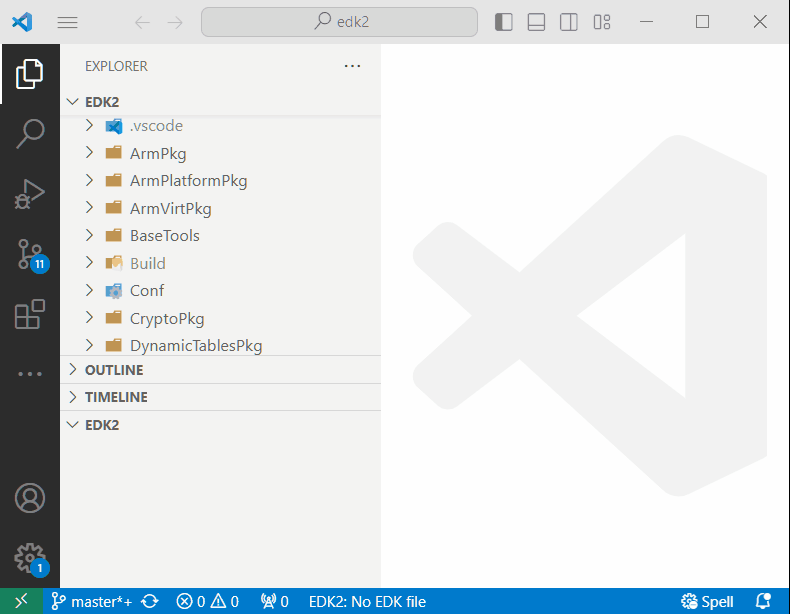
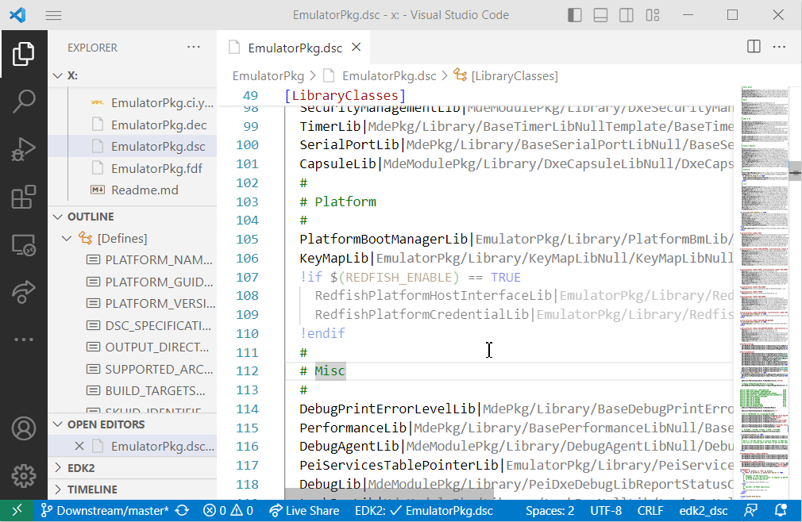
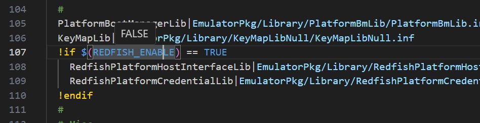
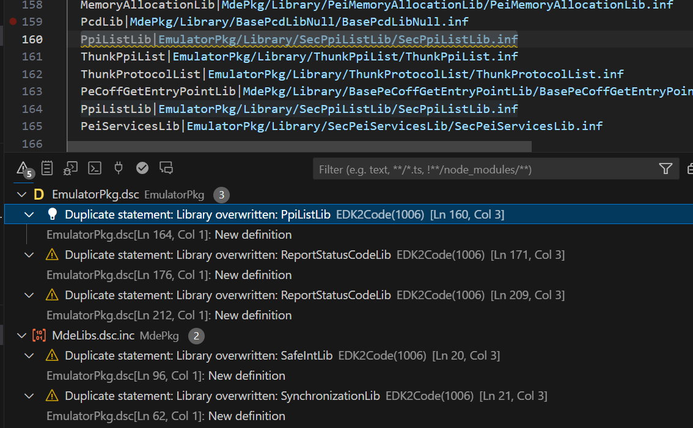
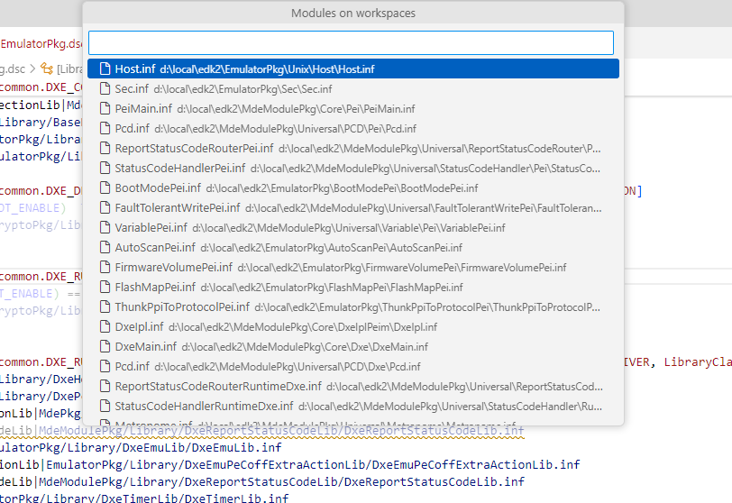
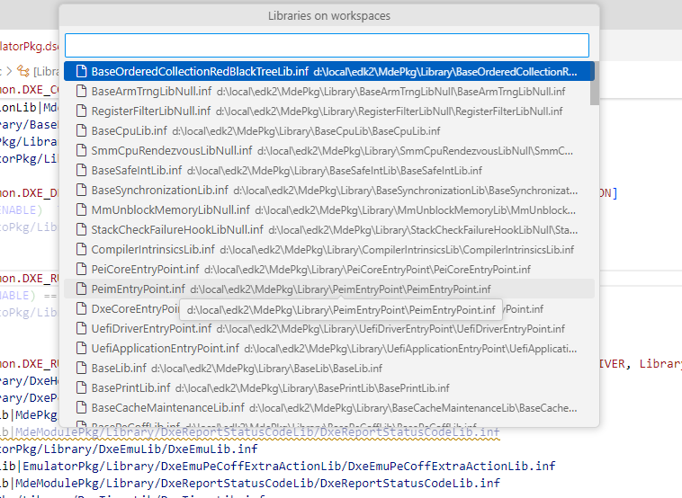
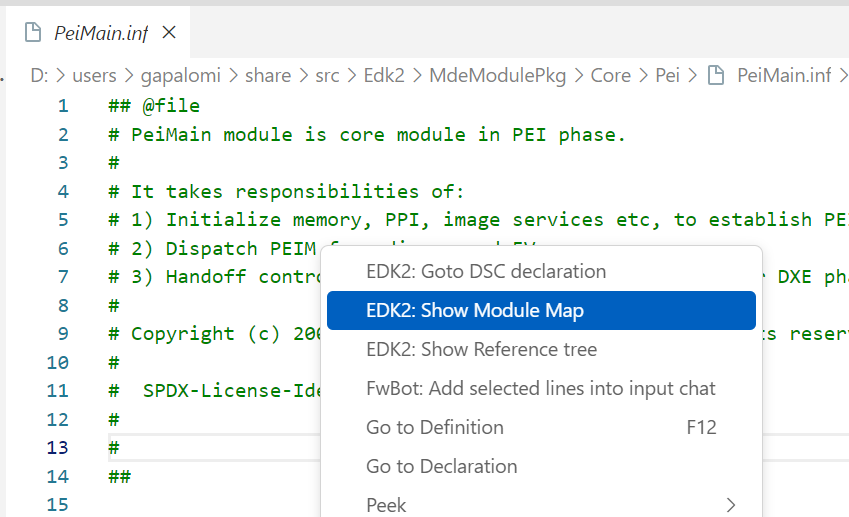
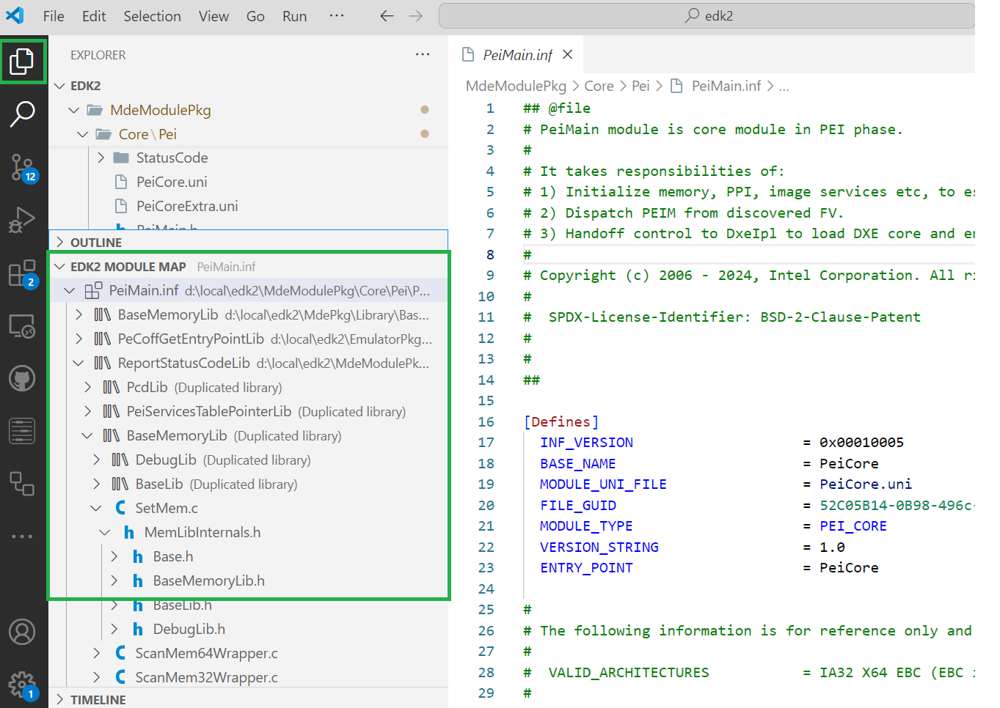
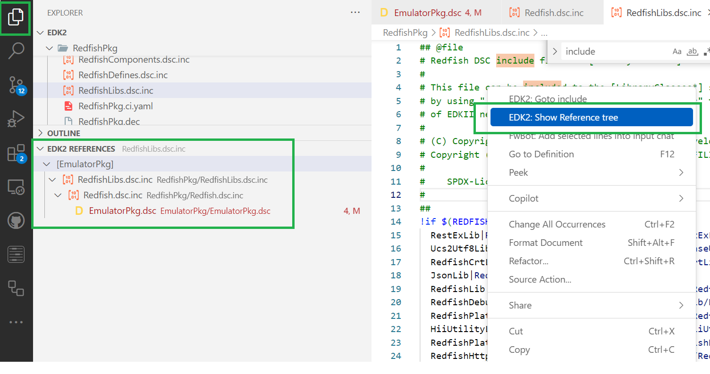

# Advanced Features


## Indexing Source Code
The index in EDK2Code is created by analyzing the project's DSC files, using the build folder as a reference. This indexing process is essential for enabling the advanced features of the EDK2Code extension, which significantly enhance the development experience for EDK2 projects.

The indexing process involves parsing the DSC (Driver, SMM, and UEFI) files, which are key configuration files in EDK2 projects, to build a comprehensive map of the code structure. The build folder is used as a reference during this process to gather all necessary compilation data, ensuring that the index accurately reflects the project's state. This index database allows the extension to offer various capabilities, such as:

- **Fast Code Navigation**: Quickly jump to definitions, references, and declarations within the codebase.
- **Accurate Code Completion**: Provide context-aware suggestions as you type, improving coding efficiency.
- **Error Detection**: Highlight potential issues in the code, such as syntax errors or undefined references.
- **Enhanced Readability**: Improve the readability of EDK2 source files through syntax highlighting and code outlining.

!!! note
    Advance features require the index database.


### Rebuilding Index Database

To leverage the full potential of the EDK2Code extension, it is essential to have an up-to-date index database. You can rebuild the index database whenever there are significant changes to the codebase that might affect the existing index. This process is initiated through the command palette in Visual Studio Code:

```
> EDK2: Rebuild index database
```

During this process, you will be prompted to select your build directory. The extension will then detect the compilations within this directory, allowing you to choose one or multiple compilations to be included in the index. Once the indexing is complete, the extension will update its database, enabling all the advanced features.




### Enabling Compile Information

Enabling compile information is an optional but highly recommended step to fully utilize the capabilities of the EDK2Code extension. By providing detailed compile information, the extension can offer more accurate and context-aware features, enhancing your development workflow.

#### Why Compile Information is Important

1. **Enhanced Code Navigation**: With compile information, the extension can more precisely map the relationships between different parts of the code. This allows for faster and more accurate navigation, such as jumping to definitions and references.
   
2. **Improved Code Completion**: Compile information enables the extension to offer more accurate and context-aware code suggestions as you type, which can significantly speed up coding and reduce errors.
   
3. **Accurate Error Detection**: By understanding the compilation context, the extension can more effectively identify potential issues in the code, such as syntax errors or undefined references, and highlight them for the developer.
   
4. **Better Readability**: Compile information helps the extension provide enhanced syntax highlighting and code outlining, making the code easier to read and understand.

#### How to Enable Compile Information

To enable compile information, you need to activate the build report feature in the EDK2 build process by setting the `-Y COMPILE_INFO` flag. This will generate detailed compile information that the EDK2Code extension can use.

For example, if you want to build `EmulatorPkg` from the EDK2 source, your build command will look like this:

```shell
build -p EmulatorPkg\EmulatorPkg.dsc -t VS2019 -a IA32 -Y COMPILE_INFO -y BuildReport.log
```

This command will generate compile information in your build folder, specifically in the `CompileInfo` directory:

```
x:\Edk2\Build\EmulatorIA32\DEBUG_VS2019\CompileInfo
```

By enabling compile information, you ensure that the EDK2Code extension has access to all the necessary details about your project's compilation process, allowing it to provide the most accurate and useful features possible.


## DSC Analysis
The DSC files are critical components of EDK2 projects, providing configurations and build instructions. Advanced DSC analysis is a powerful feature of the EDK2Code extension that helps developers understand and manage these configurations more effectively. The analysis involves parsing the DSC files to extract valuable information about the project's structure and dependencies.

### Reference Tree
This feature shows how DSC files are included and referenced within the project. By visualizing the inclusion hierarchy, developers can easily understand the relationships between different DSC files and how they contribute to the overall project structure. This helps in managing complex configurations and ensuring that all necessary files are correctly referenced.

### Dim Unused Code: 
The extension can identify and dim unused code within the DSC files. This helps developers quickly spot and clean up any code that is not being utilized, leading to a more efficient and maintainable codebase. By highlighting unused sections, the extension ensures that developers focus only on the relevant and active parts of the configuration.



### Show definition Values 
Mouse hover over DSC definitions and PCD's can display the current values of definitions, providing developers with a clear understanding of the build environment and configurations used in the project. This makes it easier to debug configuration issues and verify that the correct settings are being applied.



### Error Detection
The DSC analysis can identify potential issues within the DSC files, such incorrect paths, duplicated libraries, etc. These issues are highlighted and shown in the Visual Studio Code "Problems" window.

!!! abstract "Current support" 
    * [ ] Section is empty
    * [ ] Mixed section types are not allowed
    * [ ] Unknown section type
    * [ ] Syntax error
    * [ ] Statement has no key
    * [x] Duplicate statement
    * [ ] Undefined token space GUID
    * [x] Include path not found
    * [ ] Nested packages are not allowed
    * [x] Duplicate declaration
    * [ ] Duplicate include path
    * [ ] Duplicate GUID
    * [ ] Undefined library class
    * [ ] Syntax error in path
    * [ ] Duplicate include file
    * [x] Missing path
    * [x] Conditional block missform
    * [ ] Unused symbol
    * [ ] Empty file
    * [x] Inactive code
    * [x] Edk2Code unsupported




!!! Note
    You can disable this using the `edk2code.enableDiagnostics` setting

## Commands
This commands are only accessible using the command palette `F1` or `Ctrl + Shift + P`

### Open Module

Shows a list of all modules compiled 
```
> EDK2: Open Module
```



### Open Library

Shows a list of all libraries compiled 
```
> EDK2: Open Library
``` 



### Module Map
You can right click on a compiled INF file and select `EDK2: Show Module Map`



This will open the EDK2 submenu showing the libraries and source files that were used to compile that INF. 



This feature is helpful in visualizing how a module includes various libraries. It also provides insights into how C files within the module include header files. By understanding these relationships, developers can better manage dependencies.

### Show Reference Tree

This option illustrates how DSC and INF files are included and referenced within the project. By visualizing this inclusion hierarchy, developers can gain a clearer understanding of the relationships between different DSC and INF files and how they contribute to the overall project structure.

In EDK2 projects, this feature is particularly useful for managing complex configurations and ensuring that all necessary files are correctly referenced. It helps developers identify how modules and libraries are interconnected, which can be crucial for debugging and maintaining the project.


