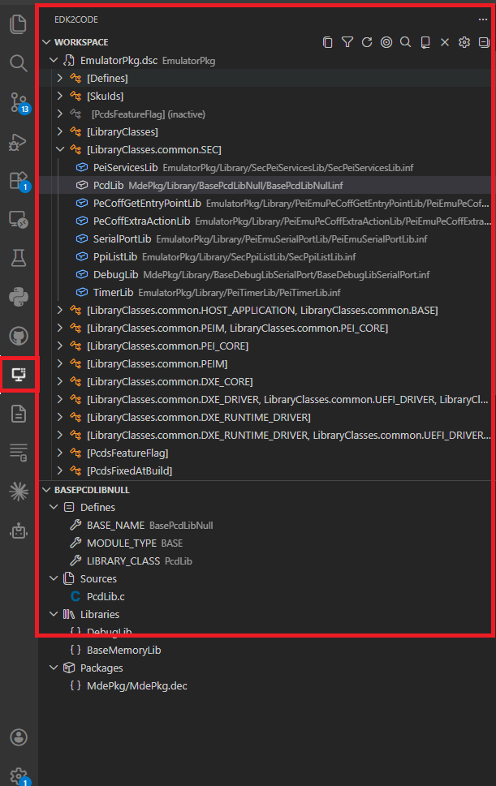
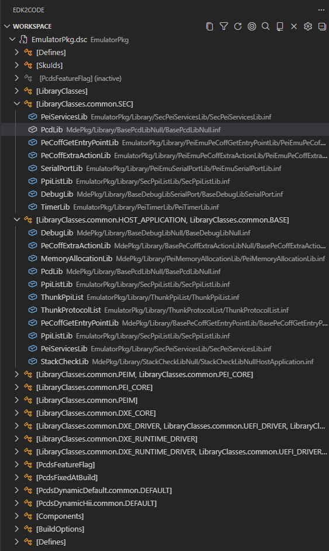
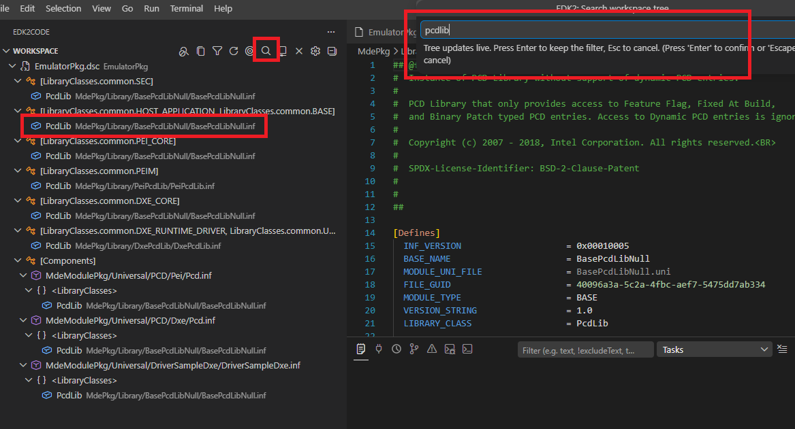
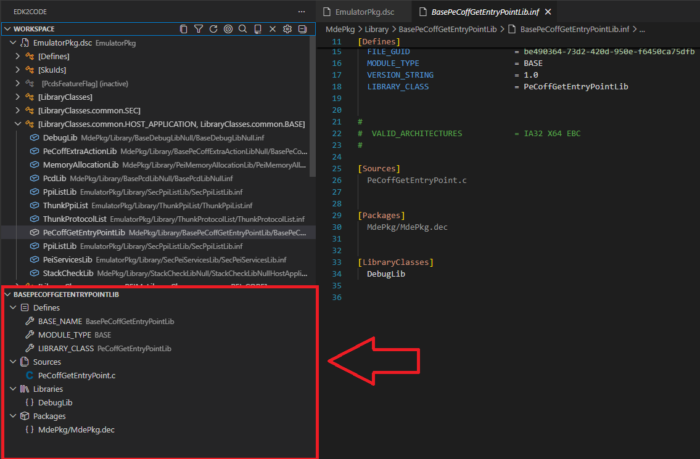
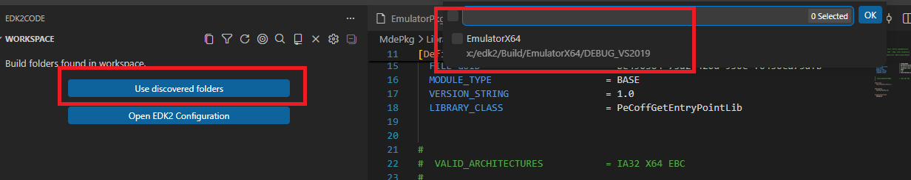
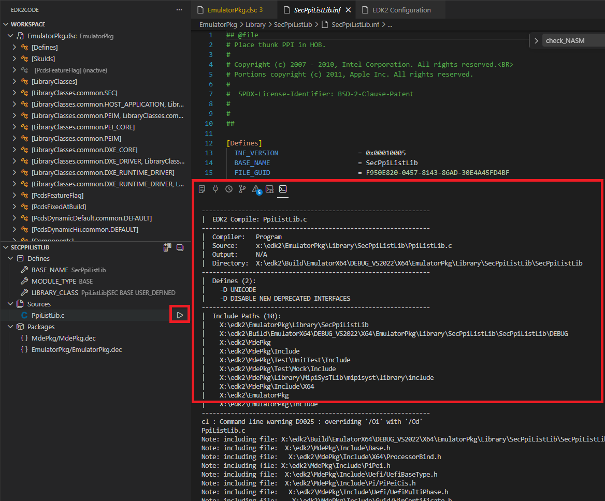
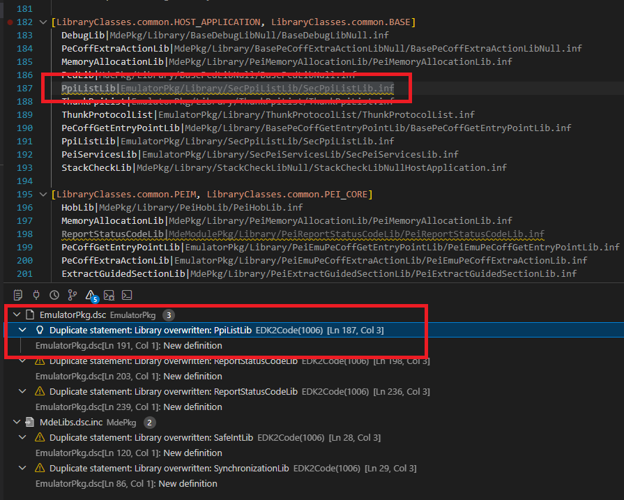
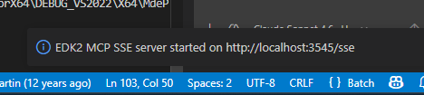

# Documentation
Before you start testing the functionality of the extension, please index [source code](https://github.com/intel/Edk2Code/wiki/Index-source-code).

## Configuration
You can check your workspace configuration with command:

```
> EDK2: Workspace configuration (UI)
```

This configuration will be automatically populated after you indexed your [source code](https://github.com/intel/Edk2Code/wiki/Index-source-code). 

- **DSC relative path** Are the main `DSC` files for your workspace
- **Build Defines** Build defines that were injected in your EDK2 build command
- **Package paths** are the paths set for the EDK2 Build command.

You can manually change this configuration. After any manual modification the user will be prompted to rescan the Index.

## Interface

### Status bar
When you open a file in the editor, you will see in the status bar a warning if the file you are looking has been compiled or not:


The following commands are expected to work only on files that have been used in compilation.

### Global commands
This commands are only accessible using the [command palette](https://code.visualstudio.com/docs/getstarted/userinterface#_command-palette) (⌨F1)

#### EDK2: Open library
Will show a list of all the libraries compiled.


#### EDK2: Open Module
Will show a list of all the modules compiled.


#### EDK2: Rebuild index database
This will clean up the current source index and will create a new one. [See](https://github.com/intel/Edk2Code/wiki/Index-source-code).

#### EDK2: Rescan index database
This will use the previous index configuration and will recreate the index without changing the workspace settings

## EDK2 language support
After you source code has been indexed you will see some of the features of using Edk2Code extension

> **⚠ IMPORTANT** Before continuing please index your code following this [instructions](https://github.com/intel/Edk2Code/wiki/Index-source-code) 


### INF files
#### Inf files will show syntax highlight:


#### Outline tree


#### Source goto definition
Right click on a source file name and then select `Go To Definition` (F12)


This will open the source file selected. This also works for `LibraryClasses`, `Pcd` and `Packages`:


The results shown are based on your DSC parsing.

#### LibraryClasses Auto completion
Start typing on the `LibraryClasses` section will show suggestions of libraries that can be included in that INF file:


This suggestions are based on DEC files in `Packages` section.

#### Goto DSC Declaration
Right click on an anywhere in an INF file and select `EDK2: Goto DSC Declaration`


This will open the DSC file where this INF file was declared.

#### Library usage
If the INF file is a library, right click and select `EDK2: Show Library usage`:


This will show what modules are using your library:


### DSC Files

#### Syntax highlight
[See](https://github.com/intel/Edk2Code/wiki/Functionality#inf-files-will-show-syntax-highlight)

#### Outline
[See](https://github.com/intel/Edk2Code/wiki/Functionality#outline-tree)

#### Variable defines resolution
DSC files will dim source that hasn't been compiled based on DEFINES.
You can see the value of the defines if you hover your mouse over.

This also works with `PCD` values


#### Goto Definition
Right click on a file path and select `Go to Definition` (F12) to open that file.

#### Goto DSC inclusion
Right click and select `Go to DSC Inclusion` to see if this DSC file was included (`!Include`) in other DSC file.

### DEC

#### Syntax highlight
[See](https://github.com/intel/Edk2Code/wiki/Functionality#inf-files-will-show-syntax-highlight)

#### Outline
[See](https://github.com/intel/Edk2Code/wiki/Functionality#outline-tree)

### C files
#### Call Hierarchy
Right on a function name and select `Show Call Hierarchy`:


This will open the References view with the [call Hierarchy](https://devblogs.microsoft.com/cppblog/c-extension-in-vs-code-1-16-release-call-hierarchy-more/) of the selected function. Edk2Code extension will filter unused calls from the view.


#### Go to INF
When you are on a C file, Right click and select `Go to INF`:


This will open the .inf file that compiled that C file.

#### Go to Definition
Right click on a C symbol (function, variable, etc) and select `EDK2: Go To Definition` to open the symbol definition. This differs from regular `Go to Definition` command provided by VSCODE as this will uses CSCOPE and compiled files to query the definitions. Sometimes it gives better results.

### VFR

#### Syntax highlight
[See](https://github.com/intel/Edk2Code/wiki/Functionality#inf-files-will-show-syntax-highlight)

#### Outline
[See](https://github.com/intel/Edk2Code/wiki/Functionality#outline-tree)

### ACPI

#### Syntax highlight
[See](https://github.com/intel/Edk2Code/wiki/Functionality#inf-files-will-show-syntax-highlight)

#### Outline
[See](https://github.com/intel/Edk2Code/wiki/Functionality#outline-tree)

#### Help
Hover on keywords of your ASL code and you will see help extracted from ACPI specification (6.3)


#### Auto complete
Start typing anywhere in your *.asl files and you will see autocomplete suggestions of ASL specification.


## Edk2Code sidebar

Starting in version `2.0.0`, the extension installs its own activity bar container. All Edk2Code views are grouped under this entry, which exposes two views: **Workspace** and **Module Info**.




### Workspace view

The **Workspace** view shows your parsed EDK2 workspace as a single, persistent tree. It replaces the older *Module Map*, *Library Tree* and *Reference Tree* commands with one navigable hierarchy of DSC → INF → libraries / sources / headers.




When no workspace is loaded yet, the welcome view offers quick actions to discover build folders or open the configuration UI.


The view title bar exposes the following actions:

| Action | Command | Description |
|--------|---------|-------------|
| `$(gear)` | `EDK2: Workspace configuration (UI)` | Open the graphical configuration panel. |
| `$(repo)` | `EDK2: Select Workspace` | Switch between loaded build configurations. |
| `$(target)` | `EDK2: Reveal active editor in workspace tree` | Locate the active file in the tree. |
| `$(search)` | `EDK2: Search workspace tree` | Find a node by name. |
| `$(filter)` | `EDK2: Filter workspace symbols` | Hide grayed-out / inactive elements. |
| `$(copy)` | `EDK2: Copy workspace tree` | Copy the tree (or a sub-tree) as text. |
| `$(refresh)` | `EDK2: Refresh workspace config` | Reload the workspace configuration. |
| `$(close)` | `EDK2: Unload workspace` | Clear the currently loaded configuration. |

Additional capabilities:

- **Drag and drop** to rearrange tree nodes.
- **Right-click → Copy path** on any node.
- Searching for symbols from the command palette will automatically switch to the workspace that owns the result.




### Module Info view

The **Module Info** view shows EDK2 module information for the file currently open in the editor. As soon as you open a C, INF or related source file that belongs to a module, the view populates with:

- The owning INF and its DSC declaration
- Libraries linked to the module
- Quick navigation actions (go to definition, open file, go to DSC declaration)

Double-click any entry to jump directly to the corresponding source location.




## Build folder auto-discovery

EDK2Code can scan your workspace and detect existing build output folders automatically — you don't need to point the extension at them manually.

- `EDK2: Discover build folders` scans the workspace.
- `EDK2: Use discovered build folders` loads the detected folders as workspace configurations.
- The Workspace welcome view exposes both actions when nothing is loaded yet.




## Compile EDK2 file

You can compile an individual EDK2 C file directly from the editor without running a full EDK2 build:

- A play (`$(play)`) icon is shown in the editor title bar on supported source files.
- The command `EDK2: Compile Edk2 file` invokes the compiler for the active `.c` file using the flags and include paths recorded in `compile_commands.json`.




> **⚠ NOTE** This compiles the **single C file** in isolation — it runs outside the regular EDK2 build system and does **not** link or produce a final binary. It is intended as a fast feedback loop to catch syntax and type errors in a single translation unit without waiting for a full platform build.

> **⚠ REQUIREMENT** This feature requires a `compile_commands.json` to be present in your workspace. This file is generated automatically when you [enable compile information](../Index-source-code.md#enable-compile-information) during your EDK2 build using the `-Y COMPILE_INFO` flag.

## Goto overwriting definition

When a symbol is overwritten in a DSC (libraries, PCDs, modules), a new code action lets you jump to the *overwriting* definition instead of the original.




## MCP server

EDK2Code can expose a **[Model Context Protocol (MCP)](https://code.visualstudio.com/docs/copilot/chat/mcp-servers) SSE server** so AI agents and tools (such as GitHub Copilot or other MCP-compatible clients) can query your parsed EDK2 workspace directly.




### Starting and stopping

Open the **Workspace configuration (UI)** panel (`EDK2: Workspace configuration (UI)`) and use the **Start MCP Server** / **Stop MCP Server** button in the MCP section, or run the commands from the palette:

```
> EDK2: Start MCP SSE Server
> EDK2: Stop MCP SSE Server
```

The `edk2code.mcpServerPort` setting controls the listening port (default `3100`).

### Auto-configure workspace MCP

To let VS Code and GitHub Copilot discover the server automatically, click **Auto-configure workspace MCP** in the Settings UI. This writes (or updates) the `edk2code` server entry in your workspace's `.vscode/mcp.json` file:

```json
{
    "servers": {
        "edk2code": {
            "type": "sse",
            "url": "http://localhost:3100/sse"
        }
    }
}
```

Once this file exists, VS Code will list the `edk2code` server under **MCP Servers** in Copilot Chat and any other MCP-compatible client. See the [VS Code MCP documentation](https://code.visualstudio.com/docs/copilot/chat/mcp-servers) for more details on how MCP servers work.

