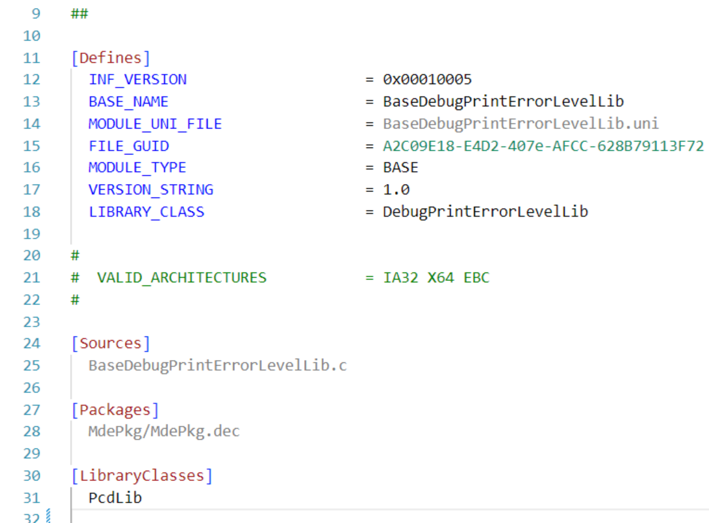
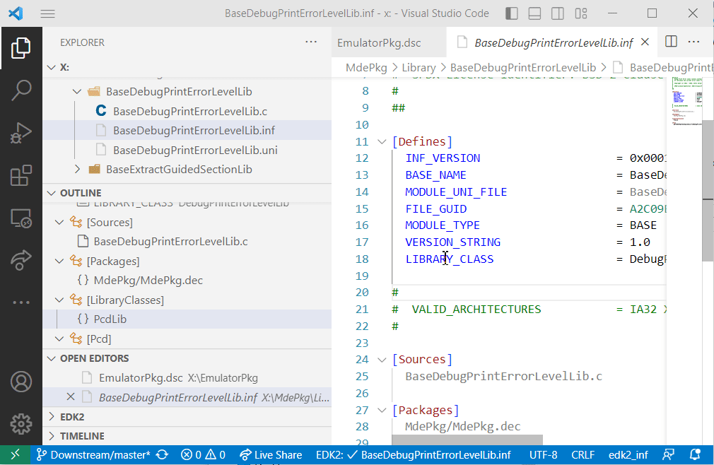
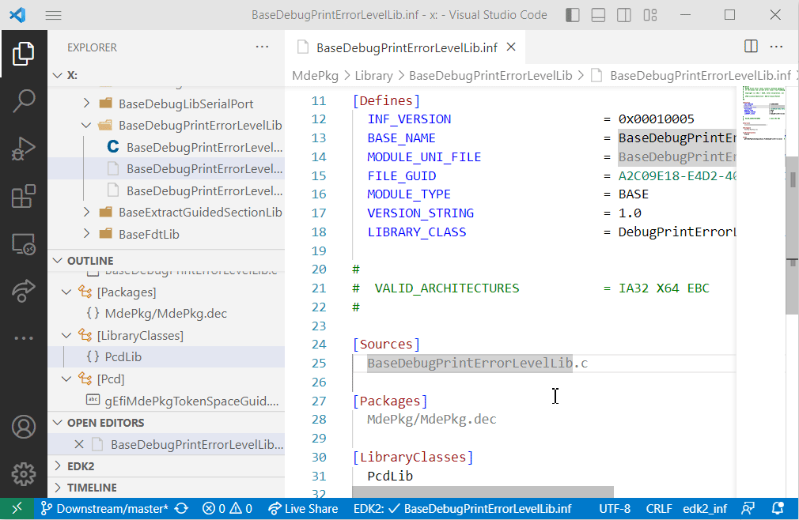
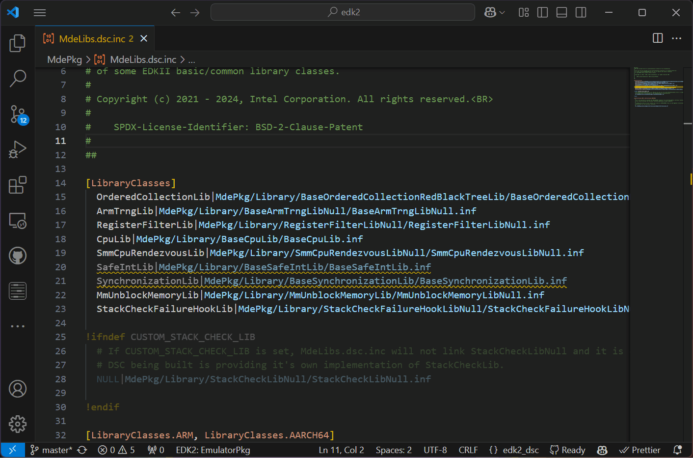
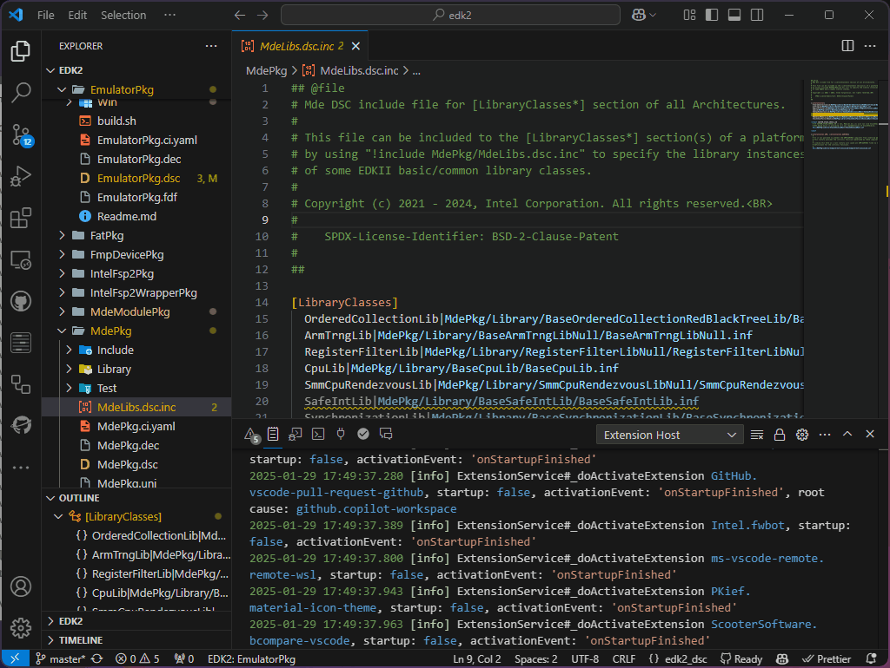
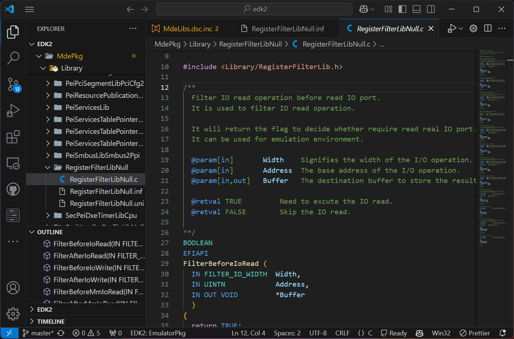
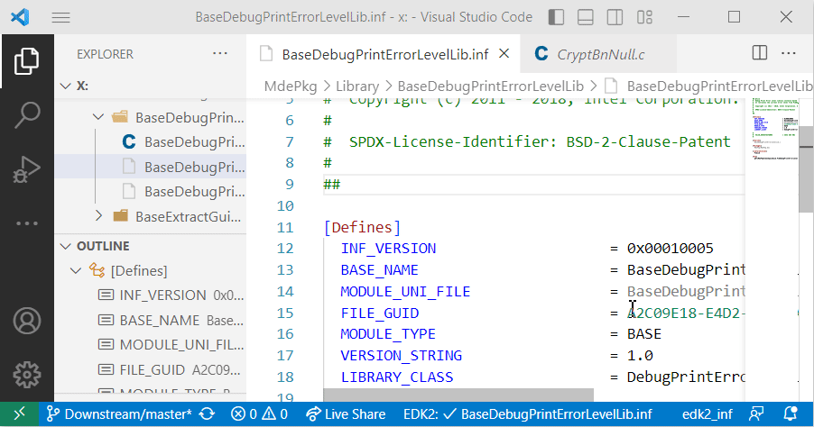

# Getting Started

## Installation Requirements

### Visual Studio Code
To get started with the EDK2Code extension, you first need to have Visual Studio Code installed on your system. You can download it from the official [Visual Studio Code website](https://code.visualstudio.com/download). Ensure you have version `^1.77.0` or later to be compatible with the EDK2Code extension.

### Cscope Installation (Windows/Linux)
Cscope is a required tool for some C-related functionalities of the EDK2Code extension. 

- **Windows**: Cscope comes included with the EDK2Code extension, so no additional installation is needed.
- **Linux**: You need to install Cscope manually. For Ubuntu, you can install it using the following command:
```sh
sudo apt install cscope
```

Additionally, if you have a preferred installation path for Cscope, you can set it using the `edk2code.cscopeOverwritePath` setting in Visual Studio Code.

## Initial Setup

### Installing the Extension
To install the EDK2Code extension:

1. Open Visual Studio Code.
2. Go to the Extensions view by clicking on the Extensions icon in the Activity Bar on the side of the window or by pressing `Ctrl+Shift+X`.
3. Search for `EDK2Code`.
4. Click on the `Install` button next to the EDK2Code extension from Intel Corporation.


Alternatively, you can manually install the extension using the `.vsix` file:

1. Download the latest `.vsix` file from the [EDK2Code releases page](https://github.com/intel/Edk2Code/releases).
2. Open Visual Studio Code.
3. Go to the Extensions view by clicking on the Extensions icon in the Activity Bar on the side of the window or by pressing `Ctrl+Shift+X`.
4. Click on the three-dot menu in the upper right corner of the Extensions view and select `Install from VSIX...`.
5. Browse to the location where you downloaded the `.vsix` file and select it to install the extension.

## Basic Functions

The EDK2Code extension provides several basic functions to enhance the coding experience. These functionalities are inferred based on the source code without knowing the actual compilation arguments. However, once the build index is generated, the results of these actions should be accurate.

Here is a table summarizing the key functions and the types of files that support each command:

| Function            | Supported File Types       |
|---------------------|----------------------------|
| Syntax Highlight    | INF, DSC, DEC, VFR, ACPI   |
| Outline             | INF, DSC, DEC, VFR, ACPI   |
| Go to Definition    | INF, DSC, C                |
| Go to include       | DSC                        |
| Go to INF           | C                          |

!!! tip
    To utilize the **advanced features** of the EDK2Code extension, you need to index the database. This indexing process enables capabilities such as fast code navigation, accurate code completion, and error detection. For more details, please refer to the [Advanced Features](advance_features.md) section.

### Syntax Highlight
Provides syntax highlighting for various EDK2 file types to improve readability and code comprehension.



### Outline
Displays an outline tree for the supported file types, helping developers to navigate through the sections of the file easily.



### Go to Definition
Allows you to right-click on a symbol (function, variable, etc.) and select `Go to Definition` (F12) to open the symbol definition. 

Example on INF file:


Example on DSC file:


### Go to include
Enables you to right-click within a DSC file and select `Go to include` to see if the DSC file was included (`!Include`) in another DSC file.



### Go to INF
When working in a C file, you can right-click and select `Go to INF` to open the .inf file that compiled the C file.



By leveraging these basic functions, the EDK2Code extension enhances navigation and readability, making the development process more efficient.

## User interface

### Status bar
When you open a file in the editor, the status bar will display a warning if the file you are viewing has not been compiled. This feature helps you quickly identify whether the current file has been successfully compiled. As EDK2 projects usually contain different implementations of the same modules, this feature helps to identify files that are actually in use.

