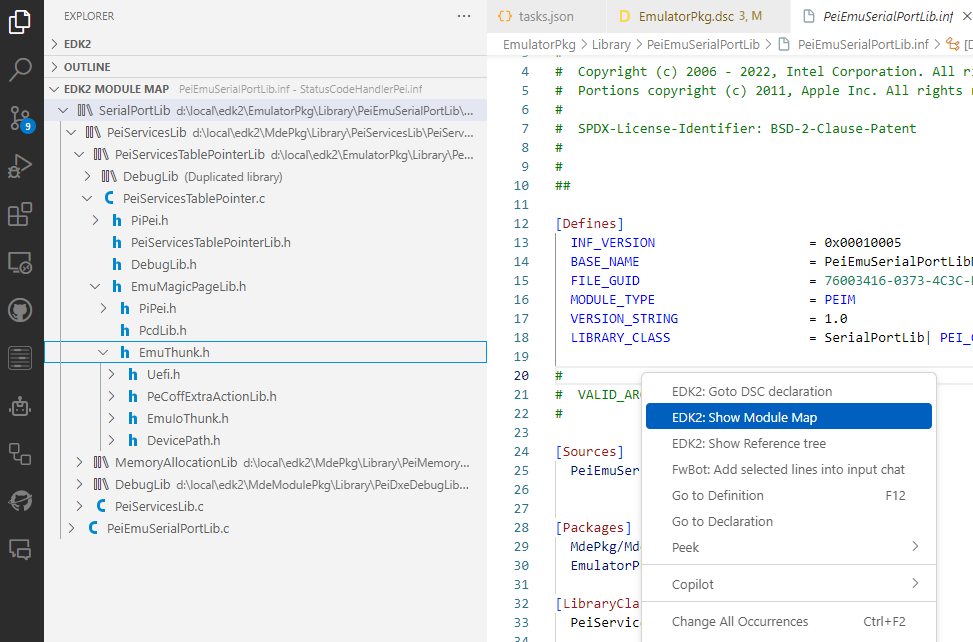
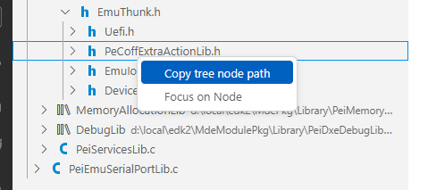

Thanks for using the **Edk2Code** Vscode extension. 

🎉 If you find this extension useful 🎉:

- ⭐ Give a start  on [Github](https://github.com/intel/Edk2Code)  
- 📜 Leave a review in [Vscode marketplace](https://marketplace.visualstudio.com/items?itemName=intel-corporation.edk2code) 
  
## 1.0.9

### DSC analysis
Shows problems in DSC files

### Module map
Added context menu action `Show Module Map`. This action is available on INF files and will open `EDK2 module map` side panel to show:
- Library tree
- Source files tree (including Header files)

You can also copy the path of the element selected in `EDK2 module map` using mouse context menu.

