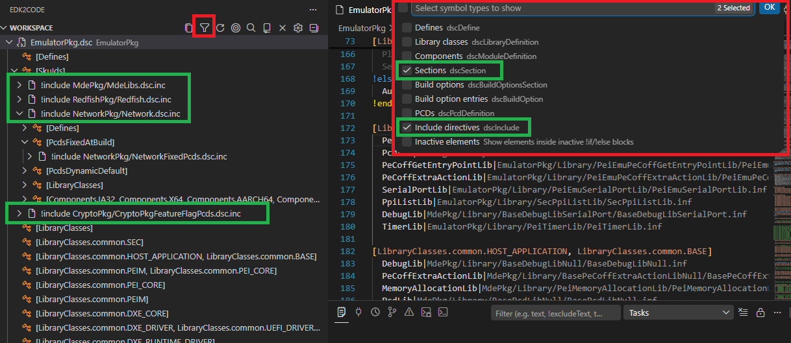
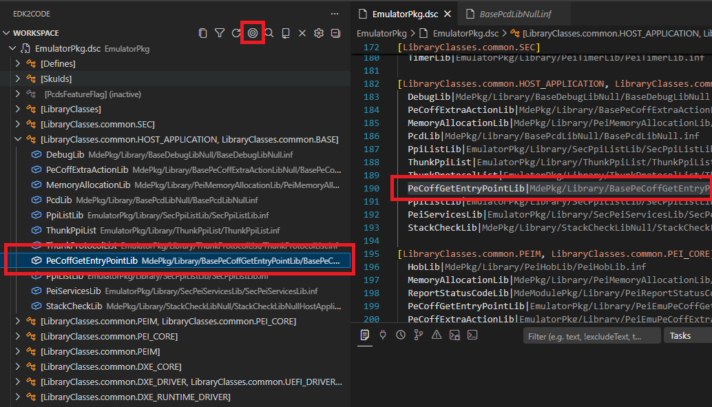
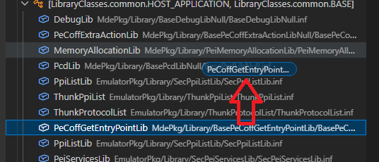
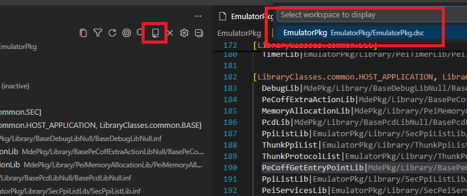
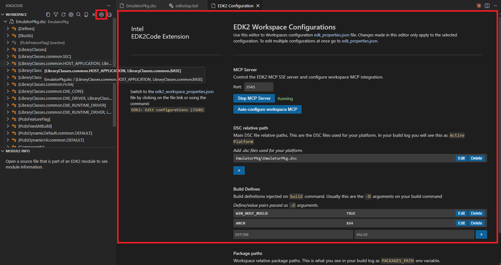

# 2.0.0

## Edk2Code sidebar

The extension now lives in a dedicated **activity bar container**. All Edk2Code views (Workspace, Module Info) are grouped together in the sidebar instead of being attached to the Explorer view.

----

## Workspace view

The new **Workspace** view is a single, persistent tree representation of your parsed EDK2 workspace. It replaces the previous *Module Map*, *Reference Tree* and *Library Tree* commands.

Key capabilities:

- **Sub-trees and includes** — DSC, INF, FDF and source files are organized hierarchically. Header includes and library sub-trees are integrated into the tree.
- **Search** — Click the `$(search)` action in the view title bar to find any node in the workspace tree.

    

- **Filter inactive elements** — Toggle the `$(filter)` action to hide grayed-out (inactive) items.

    

- **Reveal active editor** — The `$(target)` action jumps from the currently open file to its location in the workspace tree.

    

- **Drag and drop** — Reorganize nodes in the workspace tree directly with the mouse.

    

- **Multiple workspaces** — When multiple build configurations are loaded, switch between them from the `$(repo)` action in the title bar. Searching for symbols automatically switches to the workspace that owns the result.

    

- **Copy node path / Copy tree** — Quickly copy the path of a node, or export the entire tree as text via the `$(copy)` action.
- **Welcome view** — When no workspace is loaded, the view guides you through discovering build folders or opening the configuration UI.

    

----

## Module Info view

The new **Module Info** view shows the EDK2 module information for the file you are currently editing. As soon as you open a C, INF or related source file that belongs to a module, the view populates with:

- The owning INF and its DSC declaration
- Libraries linked to the module
- Quick navigation actions (go to definition, open file, go to DSC declaration)

Double-click any entry to jump directly to the corresponding source location.

----

## Build folder auto-discovery

EDK2Code can now scan your workspace and automatically detect existing build output folders, so you don't have to point the extension at them manually.

- Run **`EDK2: Discover build folders`** to scan the workspace.
- Once discovered, run **`EDK2: Use discovered build folders`** to load them directly.
- The Workspace view welcome page surfaces these actions when nothing is loaded yet.

----

## Compile EDK2 file

You can now compile an individual EDK2 file (e.g. a `.c` belonging to a module) directly from the editor.

- A play (`$(play)`) icon is shown in the editor title bar on supported source files.
- The command **`EDK2: Compile Edk2 file`** invokes the build for the parent module of the active file.

----

## MCP server integration

EDK2Code now exposes an **MCP (Model Context Protocol) SSE server** that lets AI agents and external tools query your parsed EDK2 workspace.

- Start with **`EDK2: Start MCP SSE Server`** and stop with **`EDK2: Stop MCP SSE Server`**.
- Configure the listening port via the `edk2code.mcpServerPort` setting (default `3100`).

----

## Settings UI

A redesigned graphical **Workspace configuration (UI)** panel makes managing build configurations easier — no more hand-editing JSON for common setups.

- Launch from the Workspace view title bar (`$(gear)` icon) or via the **`EDK2: Workspace configuration (UI)`** command.

----

## Goto overwriting definition

When a symbol is overwritten in a DSC (libraries, PCDs, modules), a new code action lets you jump directly to the *overwriting* definition.

----

## Other improvements

- **Disable cscope** — A new `edk2code.useCscope` setting lets you turn off cscope integration entirely. When disabled, the cscope database is not built or queried (call hierarchy and cscope-based go-to-definition become unavailable).
- **Unload workspace** — New `EDK2: Unload workspace` command to clear the currently loaded build configuration.
- **Refresh workspace config** — Reload the workspace configuration without restarting VS Code.
- **Focus INF from C files** — Improved navigation from C source files back to their owning INF module.
- **Better module symbols** — DSC parser now recognizes module sub-context sections, build options, and provides improved symbols for libraries and modules.
- **Loading and discovery indicators** — Progress indicators are shown while the workspace is being parsed or build folders are being discovered.
- **Improved grayout controller** — Inactive code regions are computed and updated more reliably.
- **Path improvements** — Missing paths now report folders instead of file names, and tooltips include the full path.
- **Extensive test suite** — New parser and workspace tests covering ASL, DEC, DSC, FDF, INF and VFR.
